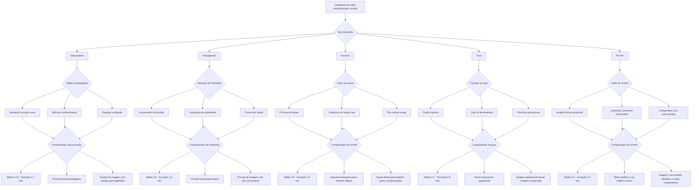

# Plano de Conversão — Prompt Graph

Este documento inaugura a segunda fase do projeto: vamos remodelar todo o pipeline de geração a partir de um grafo de decisões. Cada caminho leva a prompts exclusivos (texto, imagem, slides, duração, tonalidade) baseados na finalidade escolhida pelo usuário.

## Visão em Árvore (Mermaid)



## Combinações e Parametrizações

| Caminho                                  | Características padrões                                              | Resultado esperado                                                                                            |
| ---------------------------------------- | -------------------------------------------------------------------- | ------------------------------------------------------------------------------------------------------------- |
| Educacional → Introduzir conceito        | Slides 8, ritmo moderado, storytelling guiado por problema → solução | Prompt textual enfatiza clareza e scaffolding; prompt de imagem privilegia áreas limpas e diagramas.          |
| Educacional → Reforçar conhecimento      | Slides 6, duração curta, exemplos comparativos                       | Prompts trazem quizzes visuais e chamadas diretas para recap.                                                 |
| Educacional → Preparar avaliação         | Slides 10+, duração maior, checklists                                | Prompts incluem rubricas e contextos de aplicação prática.                                                    |
| Propaganda → Lançamento de produto       | Slides 4, duração curta, CTA final claro                             | Prompts visuais ressaltam hero shot e paleta da marca.                                                        |
| Propaganda → Campanha de autoridade      | Slides 5, ritmo médio, depoimentos                                   | Prompts textuais pedem prova social; imagens destacam figuras humanas.                                        |
| Propaganda → Conversão direta            | Slides 3, duração sub-1 min, urgência                                | Prompts focados em benefício imediato e contraste forte.                                                      |
| Eventos → Pré-evento teaser              | Slides 5, ritmo ascendente, contagem regressiva                      | Prompts alinhados à agenda, reforçando inscrições e informações logísticas.                                   |
| Eventos → Cobertura em tempo real        | Slides 4, cortes rápidos, duração 2-3 min                            | Prompts descrevem destaques do palco, público e bastidores sincronizados a timestamps.                        |
| Eventos → Pós-evento recap               | Slides 6, ritmo retrospectivo, métricas visuais                      | Prompts enfatizam highlights, depoimentos coletados e dados chave para FOMO futuro.                           |
| Guia → Passo a passo detalhado           | Slides 6-7, ritmo linear, checkpoints claros                         | Prompts textuais listam etapas numeradas; imagens apresentam fluxos visuais com ícones funcionais.            |
| Guia → Ferramentas em destaque           | Slides 5, duração 4-6 min, foco em uso de recursos                   | Prompts descrevem painéis, atalhos e estados desejados; imagens mostram interfaces/ferramentas em uso.        |
| Guia → Checklist operacional             | Slides 5, cadência compassada, reforço de regras                     | Prompts enfatizam requisitos, “do/don’t” e alertas; imagens trazem quadros organizados e badges.              |
| Review → Análise técnica profunda        | Slides 5, ritmo ponderado, duração ~3 min                            | Prompts textuais com critérios comparativos e notas; imagens focam em close-ups e especificações.             |
| Review → Unboxing / primeiras impressões | Slides 4, ritmo rápido, emoção inicial                               | Prompts destacam sensações, detalhes do packaging e primeiras reações; imagens mostram sequência de unboxing. |
| Review → Comparativo com concorrentes    | Slides 4-5, estrutura lado a lado, tempo curto                       | Prompts pedem tabelas verbais, prós/contras objetivos; imagens usam gráficos simples e produtos juntos.       |

> Cada linha será originada automaticamente ao cruzarmos o tipo de vídeo e o subobjetivo. A partir daí derivamos parâmetros (contagem de slides, duração-alvo, vocabulário, instruções visuais) e aplicamos filtros adicionais (público, idioma, plataforma).

## Prompts Deep Research por Variação

Os prompts abaixo seguem o framework completo de Deep Research (arquitetura multi-agente, instruções explícitas, MECE, 5W2H, CoT guiado, multi-perspectiva e validação). Estão escritos em inglês para maximizar qualidade, porém cada um exige saída final em português brasileiro. Use estes blocos diretamente no Claude Deep Research para investigar cada combinação antes de desenhar os prompts definitivos de geração de vídeo.

### 1. Educational — Introduce Concept

```markdown
# Research Task: Educational Video Strategy — Introducing New Concepts

## Context & Importance

- EduScript is designing narrated slide videos (8 slides, 4–7 min) that introduce brand-new concepts for students.
- We need evidence-based guidance to craft prompts covering pedagogy, narration tone, visuals and pacing for first-contact learning experiences.

## Research Scope (MECE)

1. **Learning Science Foundations**: discovery-based learning, scaffolding, attention span for 6-minute explainer videos.
2. **Narrative & Language**: hook techniques, analogies, beginner-friendly vocabulary per audience tier.
3. **Visual Systems**: diagramming styles, safe zones for captions, cognitive load best practices (Mayer principles).
4. **Assessment Hooks**: micro-checks, call-to-action for reflection, transitions into next lessons.

## Framework & Process

- Classify query as depth-first: dig deeply into first-exposure pedagogy.
- Apply 5W2H for each MECE block (what/why/who/when/where/how/how-much).
- Use guided chain-of-thought: analyze factors → counterpoints → synthesize.
- Document issue tree separating Engagement → Understanding → Retention.

## Quality Requirements

- “Go beyond basics”; cite concrete research (2020–2025) and notable practitioners.
- Highlight quantitative guardrails (slide count, wpm, time-on-screen).
- Call out gaps or conflicting evidence explicitly.

## Multi-Perspective Analysis

- Teacher, Instructional Designer, Cognitive Scientist, Student, Long-term Outcome.

## Output Structure

1. Executive summary.
2. Sections per MECE block with tables/lists as needed.
3. Prompt implications checklist (text, image, audio).
4. Risks & mitigation.

## Verification & Citations

- Fact-check every numerical claim.
- Provide inline citations (source, year, URL) and reliability notes.
- Flag low-confidence areas.

## Language & Deliverable

- Perform entire reasoning in English but deliver final documentation in Brazilian Portuguese Markdown.
```

### 2. Educational — Reinforce Knowledge

```markdown
# Research Task: Educational Video Strategy — Reinforcement Modules

## Context & Importance

- EduScript builds 6-slide recap videos (≤4 min) to reinforce previously taught material via comparisons and quizzes.
- We must discover best practices for spaced repetition, retrieval cues and visual reminders tailored to narrated slides.

## Research Scope (MECE)

1. **Retrieval Practice Science**.
2. **Contrast & Comparison Techniques**.
3. **Micro-assessment Formats**.
4. **Motivation & Engagement Hooks**.

## Methodology

- Breadth-first across K–12, higher-ed, corporate training.
- Use 5W2H per block; embed issue tree for “Why learners forget → How to counteract”.
- Enforce self-refine: after draft, critique coverage gaps then refine.

## Quality Rules

- Cite controlled studies (e.g., Roediger, Dunlosky) + modern edtech benchmarks.
- Provide implementable slide-level tactics (timing, caption placement, audio pacing).
- Identify edge cases (low motivation, remote cohorts, multilingual groups).

## Perspectives

- Educator, Assessment Specialist, Behavioral Psychologist, Learner, Program Manager.

## Output & Format

- Markdown with H2 sections per MECE block, bullet checklists, tables for quiz styles.
- Conclude with “Prompt Building Notes” mapping findings to text/image/audio prompts.

## Verification

- Cite sources with confidence scores; differentiate empirical vs anecdotal claims.
- Flag any contradictory findings.

## Language

- Output in pt-BR, maintain technical terminology.
```

### 3. Educational — Assessment Prep

```markdown
# Research Task: Educational Video Strategy — Assessment Preparation

## Context

- Videos (10+ slides, >7 min) prepare learners for exams via checklists, rubrics, practice scenarios.
- Need research on effective pre-assessment briefings, anxiety reduction, application prompts.

## Scope (MECE)

1. Assessment literacy frameworks.
2. Checklist & rubric communication styles.
3. Scenario-based rehearsal.
4. Accessibility & differentiation.

## Process

- Depth-first on high-stakes testing (HS, college, professional certification).
- Use issue tree: “Barriers to readiness → Interventions via video slides”.
- Enforce multi-perspective (student, instructor, assessor, parent, accessibility expert, future self).

## Quality Instructions

- Provide timing guidance for each segment (intro, rubric, practice, CTA).
- Include visuals guidelines (highlight colors, iconography, data density).
- Document compliance considerations (FERPA, GDPR when recording learners).

## Output

- Structured Markdown (Exec Summary, MECE sections, Prompt implications, Risks, Citations).
- Insert tables mapping readiness pain-points to slide treatments.

## Verification

- Demand citations for every claim; mark confidence.

## Language

- Deliver final write-up in Portuguese (Brasil).
```

### 4. Marketing — Product Launch

```markdown
# Research Task: Marketing Video Prompts — Product Launch CTA Videos

## Context

- 4-slide, <2 min videos with hero shots + final CTA for launches.
- Need data-backed tactics spanning storytelling, positioning, visual design, conversion copy.

## Scope (MECE)

1. Launch narrative arcs (problem → solution → proof → CTA).
2. Visual framing: hero product, palette, motion cues.
3. Conversion levers: urgency, scarcity, offer structuring.
4. Platform tailoring (YouTube, LinkedIn, paid social).

## Process

- Breadth-first across SaaS, consumer, fintech launches 2022–2025.
- Requires multi-perspective (Brand Strategist, Performance Marketer, Customer, Compliance, Long-term brand health).
- Use 5W2H per platform.

## Quality

- Provide quantitative benchmarks (CTR, VTR) when available.
- Distill creative formulas (e.g., PAS, 3-act) into slide prompts.
- Identify pitfalls (misleading claims, brand inconsistency).

## Output

- Markdown with tables linking slide slot → objective → prompt directives.
- Checklist for text/audio/image prompt tokens.

## Verification

- Cite playbooks (HubSpot, Wistia, Google/Meta studies) with links.

## Language

- Final documentation in Portuguese.
```

### 5. Marketing — Authority Campaign

```markdown
# Research Task: Marketing Video Prompts — Authority Building

## Context

- 5-slide mid-pace videos featuring testimonials/thought leadership to build trust.

## Scope

1. Proof elements (case stats, logos, credentials).
2. Narrative formats (expert POV, success story, behind-the-scenes).
3. Visual cues signalling authority (color, typography, framing).
4. Trust signals & compliance (testimonials, disclosures, regional laws).

## Method

- Depth-first on B2B/B2C authority campaigns.
- Use MECE + 5W2H; include multi-perspective (Prospect, Analyst, Legal, Brand, Long-term advocate).
- Apply self-refine for completeness.

## Quality & Output

- Provide slide-by-slide tactic tables, mention audio tone + caption strategy.
- Highlight cultural/localization requirements.
- Provide prompts implications.

## Verification

- Cite industry reports (Edelman Trust, Nielsen) and note confidence.

## Language

- Final answer in pt-BR Markdown.
```

### 6. Marketing — Conversion Sprint

```markdown
# Research Task: Marketing Video Prompts — Direct Conversion

## Context

- 3-slide, sub-60s urgency videos focused on immediate action.

## Scope

1. Offer framing & copywriting formulas (BOGO, limited seats, countdowns).
2. Visual urgency (color psychology, kinetic text, timers).
3. Optimization per channel (TikTok, Reels, Shorts, paid display).
4. Measurement & iteration loops.

## Process

- Breadth-first across DTC, SaaS trials, events.
- Use MECE + issue tree root causes for drop-off.
- Multi-perspective (Growth PM, Media Buyer, Skeptical user, Customer Success, Finance).

## Quality

- Provide concrete metrics (recommended hooks per 5s, script WPM, CTA placement).
- Map insights to text/image/audio prompt requirements.

## Output & Verification

- Markdown structure; cite CRO studies (CXL, Nielsen Norman, Meta/Google benchmarks).
- Score confidence and note data freshness.

## Language

- Output Portuguese (Brasil).
```

### 7. Events — Pre-Event Teaser

```markdown
# Research Task: Event Video Prompts — Pre-Event Teasers

## Context

- 5-slide ascendant pacing teasers with countdown and logistics reinforcement.

## Scope

1. Teaser storytelling arcs.
2. Registration boost tactics (social proof, speaker highlights, benefits).
3. Visual motifs (countdown, agenda previews, brand consistency).
4. Channel-specific delivery (email, social, ads).

## Method

- Breadth-first across conferences, community meetups, webinars.
- Use 5W2H per tactic; embed multi-perspective (Event producer, Speaker, Attendee persona, Sponsor, Operations).
- Apply chain-of-thought + self-refine.

## Output Requirements

- Provide slide objective matrix + prompt directives.
- Checklist for compliance (accessibility statements, location/reg deadlines).

## Verification

- Cite event marketing benchmarks (Splash, Bizzabo, Hopin, Eventbrite data).

## Language

- Deliver final doc in pt-BR.
```

### 8. Events — Live Coverage

```markdown
# Research Task: Event Video Prompts — Live Coverage

## Context

- 4-slide, 2–3 min videos capturing on-site highlights synced to timestamps.

## Scope

1. Real-time storytelling frameworks (before/during/after segments).
2. Shot lists & audio cues (crowd energy, speaker soundbites, ambient).
3. Rapid editing workflows & approval constraints.
4. Distribution tactics (live social, internal recaps, sponsor reels).

## Process

- Depth-first on hybrid events 2023–2025.
- Multi-perspective (Producer, AV lead, Social media lead, Attendee, Sponsor, Compliance).
- Apply MECE + 5W2H; require timeline tables.

## Quality

- Provide equipment notes, caption latency guidance, backup plans.
- Map insights to text/image/audio prompt building.

## Verification

- Cite credible sources (event playbooks, production guides) with confidence.

## Language

- Output in Portuguese.
```

### 9. Events — Post-Event Recap

```markdown
# Research Task: Event Video Prompts — Post-Event Recap

## Context

- 6-slide retrospective videos mixing metrics, testimonials, CTA for future events.

## Scope

1. Story arc (hook, highlights, outcomes, CTA).
2. Data visualization best practices for quick metrics.
3. Testimonial capture + usage rights.
4. Distribution & nurture plays.

## Method

- Breadth-first on B2B/B2C events.
- Use MECE; include multi-perspective (Attendee, Sponsor, Exec, Community manager, Prospective attendee).
- Require CoT reasoning + self-review.

## Output & Quality

- Markdown with tables mapping slide slot → data/quote/prompt cues.
- Provide risk log (missing footage, legal approvals).

## Verification

- Cite sources (Forrester events, PCMA, event marketing blogs) with reliability.

## Language

- pt-BR output.
```

### 10. Guide — Step-by-Step

```markdown
# Research Task: Guide Video Prompts — Step-by-Step Tutorials

## Context

- 6–7 slide sequential instruction videos covering processes end-to-end.

## Scope

1. Instructional design for procedural knowledge.
2. Visual signaling (callouts, numbering, safe zones).
3. Error prevention & troubleshooting integration.
4. Retention metrics (completion, task success).

## Method

- Depth-first on software tutorials, manufacturing SOPs, enablement content.
- Use MECE + 5W2H; include multi-perspective (Novice user, Power user, Trainer, QA, Compliance).
- Apply Tree-of-Thought for alternative step orders.

## Output & Quality

- Provide slide template guidelines, audio tone, caption instructions.
- Include checklists for prerequisite callouts and success criteria.

## Verification

- Reference sources (Nielsen Norman, Atlassian playbooks, technical writing guides) with confidence tags.

## Language

- Output Portuguese.
```

### 11. Guide — Tooling Spotlight

```markdown
# Research Task: Guide Video Prompts — Tooling / Feature Spotlights

## Context

- 5-slide videos showcasing software/hardware tools, emphasizing interface views and best practices.

## Scope

1. Demonstration storytelling (problem → feature → benefit → proof → CTA).
2. Visual framing for UI/UX (zoom levels, cursor highlights, overlays).
3. Voiceover guidance (tempo, jargon control, call-to-action cues).
4. Adoption metrics and measurement loops.

## Method

- Breadth-first across SaaS onboarding, productivity suites, dev tools.
- Multi-perspective (Product marketer, Customer success, Power user, Security, Localization).
- Use MECE + 5W2H + self-refine.

## Output

- Markdown with sections, slide mapping tables, prompt directive checklist.

## Verification

- Cite credible case studies (Notion, Figma, Microsoft Learn) and note confidence.

## Language

- pt-BR final doc.
```

### 12. Guide — Operational Checklist

```markdown
# Research Task: Guide Video Prompts — Operational Checklists

## Context

- 5-slide videos reinforcing policies, “do/don’t” lists, compliance steps.

## Scope

1. Checklist communication best practices.
2. Behavioral reinforcement techniques (nudges, reminders).
3. Visual hierarchy for quick scanning.
4. Compliance & audit requirements.

## Method

- Depth-first on safety, HR, IT policy rollouts.
- Multi-perspective (Operations, Auditor, Employee, Manager, Risk).
- Use MECE, 5W2H, chain-of-thought + validation.

## Output & Quality

- Provide slide blueprint, iconography guidelines, CTA suggestions.
- Include risk table for misinformation or outdated policy references.

## Verification

- Cite OSHA/ISO/HR compliance resources with confidence scoring.

## Language

- Output Portuguese.
```

### 13. Review — Technical Deep Dive

```markdown
# Research Task: Review Video Prompts — Technical Deep Dive

## Context

- 5-slide ~3 min reviews analyzing specs, benchmarks, pros/cons for sophisticated audiences.

## Scope

1. Comparative evaluation frameworks.
2. Evidence collection (benchmarks, lab tests, certifications).
3. Visual storytelling for specs (charts, highlights, macro shots).
4. Disclosure & ethics requirements.

## Method

- Depth-first on hardware/software reviews 2022–2025.
- Multi-perspective (Engineer, Power user, Procurement, Legal, Long-term maintainer).
- Use issue tree for “Evaluation dimensions → Prompt implications”.

## Output

- Markdown sections, spec comparison tables, prompt directives.

## Verification

- Cite reputable review labs (RTINGS, NotebookCheck, StudioBinder, etc.) with reliability.

## Language

- Portuguese.
```

### 14. Review — Unboxing / First Impressions

```markdown
# Research Task: Review Video Prompts — Unboxing / First Impressions

## Context

- 4-slide fast-paced videos capturing anticipation, packaging, tactile impressions.

## Scope

1. Emotional beats (anticipation, reveal, reaction, CTA).
2. Visual sequencing (macro shots, lighting, B-roll suggestions).
3. Authenticity cues & disclosure rules.
4. Platform adaptations (TikTok, Shorts, Instagram Reels).

## Method

- Breadth-first on consumer electronics, DTC goods.
- Multi-perspective (Creator, Viewer, Brand partner, Regulator, Sustainability advocate).
- Use MECE/5W2H + self-refine.

## Output & Verification

- Markdown with slide-by-slide matrix, prompt notes, risk list (e.g., embargo terms).
- Cite creator economy reports, FTC guidelines, platform playbooks.

## Language

- Output pt-BR.
```

### 15. Review — Competitive Comparison

```markdown
# Research Task: Review Video Prompts — Competitive Comparison

## Context

- 4–5 slide side-by-side reviews contrasting multiple products with objective metrics.

## Scope

1. Comparison frameworks (scorecards, quadrant charts, pros/cons).
2. Data collection & normalization.
3. Visual layouts (split screen, overlay, color coding).
4. Fairness, bias mitigation, disclosure.

## Method

- Depth-first on enterprise + consumer comparisons.
- Multi-perspective (Decision-maker, End user, Legal, Analyst, Future-proofing).
- Use MECE + 5W2H + chain-of-thought; require tables.

## Quality & Output

- Provide formulas for weighting criteria, slide mapping tables, prompt directives.
- Highlight pitfalls (cherry-picking, outdated data).

## Verification

- Cite Gartner/Forrester reports, independent labs, watchdog articles; rate confidence.

## Language

- Deliver final document in Portuguese.
```

## Próximos Marcos

1. **Catalogar prompts** específicos surgidos de cada ramo da árvore.
2. **Testar** combinações principais em lote (ex.: Educacional + Conceito Novo para públicos diferentes) e medir resultados.
3. **Adicionar** novas folhas (Eventos, Guia, Review, Treinamentos internos) mantendo o mesmo formato para facilitar auditoria futura.

## Briefs de Pesquisa Profunda por Finalidade

Cada prompt abaixo descreve o objetivo da investigação que precisamos realizar antes de desenhar os prompts definitivos de geração. O pesquisador deve retornar insights, requisitos e exemplos concretos.

### 1. Educacional

```
Projeto: Vídeos educacionais baseados em slides narrados.
Objetivo do prompt: Construir instruções completas para geração de roteiro, imagens e assets visuais voltados a ensino formal.
Tarefa: Realize uma pesquisa profunda sobre boas práticas pedagógicas audiovisuais, considerando níveis de ensino, gradação de dificuldade, espaço para legendas, formatos de avaliação e referências visuais que favoreçam retenção. Liste fontes, frameworks e métricas a observar antes de escrever qualquer prompt.
```

### 2. Propaganda

```
Projeto: Vídeos de propaganda orientados a conversão rápida.
Objetivo do prompt: Definir instruções que equilibrem storytelling de marca, posicionamento de produto e chamadas para ação eficientes.
Tarefa: Faça uma pesquisa profunda sobre tendências atuais de vídeo marketing em plataformas curtas e longas, abordando construção de autoridade, CTAs mensuráveis, design visual centrado no produto e limitações de tempo. Registre benchmarks e dados que devem fundamentar o prompt final.
```

### 3. Eventos

```
Projeto: Vídeos para eventos (pré, durante e pós) que combinam narrativa cronológica com informações logísticas.
Objetivo do prompt: Criar instruções adaptáveis que cubram teasers, cobertura em tempo real e recaps com métricas, garantindo consistência visual e clareza de agenda.
Tarefa: Realize uma pesquisa profunda sobre formatos de comunicação para eventos corporativos e comunitários, considerando: melhores práticas de contagem regressiva, elementos obrigatórios de cobertura (palestrantes, público, bastidores), storytelling pós-evento com dados e depoimentos, e requisitos técnicos para diferentes telas em ambientes ao vivo. Liste referências de marcas e eventos exemplarmente executados.
```

### 4. Guia

```
Projeto: Vídeos-guia que ensinam processos passo a passo, configuram ferramentas ou estabelecem checklists operacionais.
Objetivo do prompt: Elaborar instruções que favoreçam clareza sequencial, checkpoints verificáveis e visuais que reforcem cada etapa.
Tarefa: Realize uma pesquisa profunda sobre formatos de tutorial/guias em vídeo (educacionais, técnicos e corporativos), cobrindo: melhores práticas de segmentação de passos, formas de sinalizar pré-requisitos, uso de sobreposições e callouts visuais, e expectativas de métricas (retenção por etapa, taxa de conclusão). Catalogar exemplos de referência e frameworks adotados por empresas de enablement.
```

### 5. Review

```
Projeto: Vídeos de review (produto, serviço ou conteúdo) que combinam análise crítica e recomendações.
Objetivo do prompt: Definir instruções que equilibrem critérios objetivos, percepções subjetivas e entregas visuais que sustentem credibilidade.
Tarefa: Faça uma pesquisa profunda sobre formatos de review em diferentes plataformas (YouTube longo, Shorts/Reels, blogs em vídeo), contemplando: matrizes de avaliação, dados comparativos, storytelling de unboxing, requisitos de disclosure e melhores práticas de design para destacar especificações. Traga benchmarks e guidelines regulatórias relevantes antes da redação do prompt final.
```

_(Novos tipos serão anexados conforme expandirmos o grafo.)_
