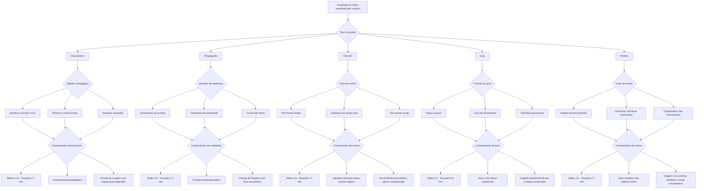

# Plano de Conversão — Prompt Graph

Este documento inaugura a segunda fase do projeto: vamos remodelar todo o pipeline de geração a partir de um grafo de decisões. Cada caminho leva a prompts exclusivos (texto, imagem, slides, duração, tonalidade) baseados na finalidade escolhida pelo usuário.

## Visão em Árvore (Mermaid)

## Combinações e Parametrizações

| Caminho                                  | Características padrões                                              | Resultado esperado                                                                                            |
| ---------------------------------------- | -------------------------------------------------------------------- | ------------------------------------------------------------------------------------------------------------- |
| Educacional → Introduzir conceito        | Slides 8, ritmo moderado, storytelling guiado por problema → solução | Prompt textual enfatiza clareza e scaffolding; prompt de imagem privilegia áreas limpas e diagramas.          |
| Educacional → Reforçar conhecimento      | Slides 6, duração curta, exemplos comparativos                       | Prompts trazem quizzes visuais e chamadas diretas para recap.                                                 |
| Educacional → Preparar avaliação         | Slides 10+, duração maior, checklists                                | Prompts incluem rubricas e contextos de aplicação prática.                                                    |
| Propaganda → Lançamento de produto       | Slides 4, duração curta, CTA final claro                             | Prompts visuais ressaltam hero shot e paleta da marca.                                                        |
| Propaganda → Campanha de autoridade      | Slides 5, ritmo médio, depoimentos                                   | Prompts textuais pedem prova social; imagens destacam figuras humanas.                                        |
| Propaganda → Conversão direta            | Slides 3, duração sub-1 min, urgência                                | Prompts focados em benefício imediato e contraste forte.                                                      |
| Eventos → Pré-evento teaser              | Slides 5, ritmo ascendente, contagem regressiva                      | Prompts alinhados à agenda, reforçando inscrições e informações logísticas.                                   |
| Eventos → Cobertura em tempo real        | Slides 4, cortes rápidos, duração 2-3 min                            | Prompts descrevem destaques do palco, público e bastidores sincronizados a timestamps.                        |
| Eventos → Pós-evento recap               | Slides 6, ritmo retrospectivo, métricas visuais                      | Prompts enfatizam highlights, depoimentos coletados e dados chave para FOMO futuro.                           |
| Guia → Passo a passo detalhado           | Slides 6-7, ritmo linear, checkpoints claros                         | Prompts textuais listam etapas numeradas; imagens apresentam fluxos visuais com ícones funcionais.            |
| Guia → Ferramentas em destaque           | Slides 5, duração 4-6 min, foco em uso de recursos                   | Prompts descrevem painéis, atalhos e estados desejados; imagens mostram interfaces/ferramentas em uso.        |
| Guia → Checklist operacional             | Slides 5, cadência compassada, reforço de regras                     | Prompts enfatizam requisitos, “do/don’t” e alertas; imagens trazem quadros organizados e badges.              |
| Review → Análise técnica profunda        | Slides 5, ritmo ponderado, duração ~3 min                            | Prompts textuais com critérios comparativos e notas; imagens focam em close-ups e especificações.             |
| Review → Unboxing / primeiras impressões | Slides 4, ritmo rápido, emoção inicial                               | Prompts destacam sensações, detalhes do packaging e primeiras reações; imagens mostram sequência de unboxing. |
| Review → Comparativo com concorrentes    | Slides 4-5, estrutura lado a lado, tempo curto                       | Prompts pedem tabelas verbais, prós/contras objetivos; imagens usam gráficos simples e produtos juntos.       |

> Cada linha será originada automaticamente ao cruzarmos o tipo de vídeo e o subobjetivo. A partir daí derivamos parâmetros (contagem de slides, duração-alvo, vocabulário, instruções visuais) e aplicamos filtros adicionais (público, idioma, plataforma).
>
> Implementação atual: o catálogo programático vive em [src/content/prompts](../src/content/prompts) e o `InputStep` usa esses blueprints para alimentar o fluxo principal.

## Indagações derivadas do guia de Design Instrucional

O relatório "Design Instrucional e Pipelines de IA para Vídeos Educacionais" levanta hipóteses que precisamos validar antes de consolidar prompts definitivos. Abaixo registramos perguntas abertas (não conclusões) para orientar ajustes posteriores.

### Segmentação de público & necessidades especiais

- Como parametrizar automaticamente duração, ritmo e tom quando o usuário seleciona faixas etárias descritas (infantil 3-10 min, fundamental I 8-15 min, etc.)?
- Que combinações de seletores precisamos para contemplar contextos (formal, corporativo, MOOC, microlearning) e motivações (obrigatório vs. voluntário)?
- De que forma capturamos requisitos de acessibilidade específicos (audiodescrição, Libras, contrastes 4.5:1) dentro dos prompts de texto/imagem/áudio?
- Precisamos de campos extras para necessidades como TDAH, autismo, dislexia ou isso deve virar um pós-processamento?

### Taxonomia de conteúdo e formatos

- Como distinguiremos prompts para dimensões de conhecimento (factual, conceitual, procedural, metacognitivo) para refletir estruturas sugeridas (tell-show-tell, exemplos trabalhados)?
- Existe dependência entre domínio (STEM, humanidades, soft skills, compliance) e escolha automática de formatação visual ou duração ideal indicada?
- Devemos introduzir seletores explícitos para formatos (tutorial, demonstração, storytelling) citados na tabela?

### Fundamentos pedagógicos

- Quais prompts precisam referenciar diretamente Mayer, Gagné, Sweller, Merrill ou modelo ADDIE/SAM? Há risco de sobrecarregar o modelo com instruções redundantes?
- Como garantiremos eventos instrucionais de Gagné completos dentro do script gerado (principalmente elicitar performance/feedback/transferência)?
- Devemos pedir ao modelo para monitorar carga cognitiva (intrínseca, estranha, germane) ou isso fica para validação posterior?

### Visuais, mídia e acessibilidade

- Como os prompts de imagem incorporam decisões sobre animação vs. frame estático sem assumir certezas (ex.: procedural motor x referência futura)?
- Precisamos pedir explicitamente por labels embutidos, disclosure progressiva e verificação de contrastes ou tratamos isso como checklist manual?
- Há forma de adicionar instruções para verificação de precisão (especialmente em domínios científicos) sem comprometer criatividade?

### Pipeline, personalização e QA

- Onde introduzimos captura de perfil do aprendiz e personalização por interesses? Isso deve acontecer antes do prompt principal ou como camada de pós-processamento?
- Quais etapas de QA multi-camada serão automatizadas (gramática, factual, pedagógico, acessibilidade) versus revisadas por humanos?
- Precisamos de prompts adicionais para validação de imagens/audio, conforme estudo que apontou altas taxas de erro em visuais médicos?

As perguntas acima devem acompanhar cada discussão de prompt para garantir aderência aos achados do documento. Ainda não há respostas definitivas; usamos as indagações como trilhas de investigação.

## Prompts Deep Research por Variação

Cada variação já possui um relatório completo em docs/prompts. Use os caminhos abaixo para abrir o arquivo correspondente.

### 1. Educational — Introduce Concept

Resultado consolidado em docs/prompts/compass_artifact_wf-f802b3a9-6a9b-42ea-93e6-d0b950aa9f5c_text_markdown.md.

### 2. Educational — Reinforce Knowledge

Resultado consolidado em docs/prompts/compass_artifact_wf-71fcea04-a94a-48c9-b907-59c52136d0d2_text_markdown.md.

### 3. Educational — Assessment Prep

Resultado consolidado em docs/prompts/compass_artifact_wf-9c8d339a-dc43-4f11-ac5d-6cff16db51ef_text_markdown.md.

### 4. Marketing — Product Launch

Resultado consolidado em docs/prompts/compass_artifact_wf-cbb4d8b4-1b71-40f5-94eb-c72b9fb0d801_text_markdown.md.

### 5. Marketing — Authority Campaign

Resultado consolidado em docs/prompts/compass_artifact_wf-cba439ad-cea5-4c35-a854-615eb73d67bb_text_markdown.md.

### 6. Marketing — Conversion Sprint

Resultado consolidado em docs/prompts/compass_artifact_wf-5ce4a4d3-6429-41d1-a6c0-c0e8fcac4be0_text_markdown.md.

### 7. Events — Pre-Event Teaser

Resultado consolidado em docs/prompts/compass_artifact_wf-a2cf54f1-ba2f-49ea-a954-15a37777f5fa_text_markdown.md.

### 8. Events — Live Coverage

Resultado consolidado em docs/prompts/compass_artifact_wf-29b6c56f-300e-44c5-8d8d-34b29907ddf6_text_markdown.md.

### 9. Events — Post-Event Recap

Resultado consolidado em docs/prompts/compass_artifact_wf-fdb99af3-4bc0-4386-bf98-2405536b80e0_text_markdown.md.

### 10. Guide — Step-by-Step

Resultado consolidado em docs/prompts/compass_artifact_wf-81f243f2-ad7c-4998-bc0d-50d9a5260d20_text_markdown.md.

### 11. Guide — Tooling Spotlight

Resultado consolidado em docs/prompts/compass_artifact_wf-2a508d4e-a9fb-44e7-8da3-d7e8ab983b50_text_markdown.md.

### 12. Guide — Operational Checklist

Resultado consolidado em docs/prompts/compass_artifact_wf-bcab45aa-21ae-4585-8315-2cd5897c2a86_text_markdown.md.

### 13. Review — Technical Deep Dive

Resultado consolidado em docs/prompts/compass_artifact_wf-522cd4f8-a7a4-41bc-b168-72dad999d3e8_text_markdown.md.

### 14. Review — Unboxing / First Impressions

Resultado consolidado em docs/prompts/compass_artifact_wf-29142666-77a7-4322-b99a-3de2bd4f05f9_text_markdown.md.

### 15. Review — Competitive Comparison

Resultado consolidado em docs/prompts/compass_artifact_wf-f1839c6e-45be-4d7a-8aa5-85704399609e_text_markdown.md.

## Próximos Marcos

1. **Catalogar prompts** específicos surgidos de cada ramo da árvore.
2. **Testar** combinações principais em lote (ex.: Educacional + Conceito Novo para públicos diferentes) e medir resultados.
3. **Adicionar** novas folhas (Eventos, Guia, Review, Treinamentos internos) mantendo o mesmo formato para facilitar auditoria futura.

## Briefs de Pesquisa Profunda por Finalidade

As pesquisas consolidadas para cada finalidade também estão organizadas em docs/prompts. Use a lista abaixo para navegar rapidamente.

### 1. Educacional

- Introduzir conceito: docs/prompts/compass_artifact_wf-f802b3a9-6a9b-42ea-93e6-d0b950aa9f5c_text_markdown.md
- Reforçar conhecimento: docs/prompts/compass_artifact_wf-71fcea04-a94a-48c9-b907-59c52136d0d2_text_markdown.md
- Preparar avaliação: docs/prompts/compass_artifact_wf-9c8d339a-dc43-4f11-ac5d-6cff16db51ef_text_markdown.md

### 2. Propaganda

- Lançamento de produto: docs/prompts/compass_artifact_wf-cbb4d8b4-1b71-40f5-94eb-c72b9fb0d801_text_markdown.md
- Campanha de autoridade: docs/prompts/compass_artifact_wf-cba439ad-cea5-4c35-a854-615eb73d67bb_text_markdown.md
- Conversão direta: docs/prompts/compass_artifact_wf-5ce4a4d3-6429-41d1-a6c0-c0e8fcac4be0_text_markdown.md

### 3. Eventos

- Pré-evento teaser: docs/prompts/compass_artifact_wf-a2cf54f1-ba2f-49ea-a954-15a37777f5fa_text_markdown.md
- Cobertura em tempo real: docs/prompts/compass_artifact_wf-29b6c56f-300e-44c5-8d8d-34b29907ddf6_text_markdown.md
- Pós-evento recap: docs/prompts/compass_artifact_wf-fdb99af3-4bc0-4386-bf98-2405536b80e0_text_markdown.md

### 4. Guia

- Passo a passo detalhado: docs/prompts/compass_artifact_wf-81f243f2-ad7c-4998-bc0d-50d9a5260d20_text_markdown.md
- Ferramentas em destaque: docs/prompts/compass_artifact_wf-2a508d4e-a9fb-44e7-8da3-d7e8ab983b50_text_markdown.md
- Checklist operacional: docs/prompts/compass_artifact_wf-bcab45aa-21ae-4585-8315-2cd5897c2a86_text_markdown.md

### 5. Review

- Análise técnica profunda: docs/prompts/compass_artifact_wf-522cd4f8-a7a4-41bc-b168-72dad999d3e8_text_markdown.md
- Unboxing / primeiras impressões: docs/prompts/compass_artifact_wf-29142666-77a7-4322-b99a-3de2bd4f05f9_text_markdown.md
- Comparativo com concorrentes: docs/prompts/compass_artifact_wf-f1839c6e-45be-4d7a-8aa5-85704399609e_text_markdown.md

_(Novos tipos serão anexados conforme expandirmos o grafo.)_
