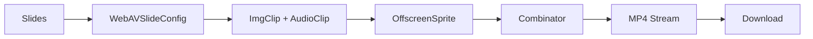

# WebAV Integration Guide

## Visão Geral

O **EduScript AI** agora utiliza o [WebAV](https://github.com/WebAV-Tech/WebAV) como engine principal de renderização de vídeo, proporcionando **20x mais performance** em comparação com FFmpeg.wasm através de aceleração de GPU via WebCodecs API.

## Arquitetura

### Pacotes Instalados

```json
{
  "@webav/av-cliper": "^1.x.x",   // Engine de processamento (clips, sprites, combinator)
  "@webav/av-canvas": "^1.x.x",   // Canvas interativo (futuro)
  "@webav/av-recorder": "^1.x.x"  // Gravação de MediaStream
}
```

### Fluxo de Renderização



## Requisitos de Navegador

| Navegador | Versão Mínima | Suporte |
|-----------|---------------|---------|
| Chrome    | 102+          | ✅ Completo |
| Edge      | 102+          | ✅ Completo |
| Firefox   | 133+          | ⚠️ Parcial |
| Safari    | 16.6+         | ⚠️ Apenas decode |

### Cross-Origin Isolation (OBRIGATÓRIO)

O WebAV requer **SharedArrayBuffer**, que só funciona com headers CORS específicos:

```http
Cross-Origin-Embedder-Policy: require-corp
Cross-Origin-Opener-Policy: same-origin
```

#### Configuração no Vite

Já configurado em [vite.config.ts](../vite.config.ts):

```typescript
server: {
  headers: {
    'Cross-Origin-Embedder-Policy': 'require-corp',
    'Cross-Origin-Opener-Policy': 'same-origin',
  },
},
preview: {
  headers: {
    'Cross-Origin-Embedder-Policy': 'require-corp',
    'Cross-Origin-Opener-Policy': 'same-origin',
  },
}
```

#### Configuração em Produção (Nginx)

```nginx
location / {
    add_header Cross-Origin-Opener-Policy "same-origin" always;
    add_header Cross-Origin-Embedder-Policy "require-corp" always;
}
```

## Estrutura de Código

### Tipos e Utilidades

| Arquivo | Descrição |
|---------|-----------|
| [src/shared/types/webav.types.ts](../src/shared/types/webav.types.ts) | Tipos TypeScript customizados (WebAVSlideConfig, RenderProgress, etc.) |
| [src/shared/utils/webav.utils.ts](../src/shared/utils/webav.utils.ts) | Helpers (detecção de capabilities, conversão blob→stream, formatação) |
| [src/shared/services/audioConversion.service.ts](../src/shared/services/audioConversion.service.ts) | Conversão de AudioBuffer para WAV (para AudioClip) |

### Hook Principal

```typescript
// src/shared/hooks/useWebAVRenderer.ts
const { render, cancel, isRendering, progress, capabilities } = useWebAVRenderer({
  config: { width: 1920, height: 1080 },
  onProgress: (progress) => console.log(`${progress.progress * 100}%`),
  onError: (error) => console.error(error),
});

const result = await render(slides);
// result.blobUrl pronto para download
```

### Componente de UI

```typescript
// src/features/video-generation/components/PreviewStep/WebAVRenderer.tsx
<WebAVRenderer
  slides={slides}
  aspectRatio={aspectRatio}
  isRendering={isRendering}
  onRenderStart={() => setIsRendering(true)}
  onRenderComplete={() => setIsRendering(false)}
  onRenderError={(error) => handleError(error)}
/>
```

## Conversão de Slides

Cada slide do projeto é convertido para `WebAVSlideConfig`:

```typescript
interface WebAVSlideConfig {
  id: string;
  imageUrl: string;           // Blob URL da imagem
  audioUrl: string;           // Blob URL do áudio
  duration: Microseconds;     // Duração em microsegundos (1s = 1_000_000)
  offset: Microseconds;       // Posição na timeline
  zIndex?: number;
}
```

### Unidades de Tempo

⚠️ **IMPORTANTE**: Toda a API do WebAV usa **microsegundos**, não segundos!

```typescript
import { toMicroseconds, toSeconds } from '@/shared/types/webav.types';

const durationSeconds = 5;
const durationMicros = toMicroseconds(durationSeconds); // 5_000_000

const microseconds = 3_500_000;
const seconds = toSeconds(microseconds); // 3.5
```

## Processo de Renderização

### 1. Criar Clips

```typescript
// Imagem
const imageBlob = await fetch(slide.imageUrl).then(r => r.blob());
const imageBitmap = await createImageBitmap(imageBlob);
const imageClip = new ImgClip(imageBitmap);

// Áudio
const audioBlob = slide.audioBlob;
const audioStream = audioBlob.stream();
const audioClip = new AudioClip(audioStream, { volume: 1.0 });
await audioClip.ready;
```

### 2. Criar Sprites

```typescript
const imageSprite = new OffscreenSprite(imageClip);
imageSprite.time = { offset: 0, duration: 5_000_000 }; // 5 segundos
imageSprite.rect = { x: 0, y: 0, w: 1920, h: 1080 };
imageSprite.zIndex = 1;

const audioSprite = new OffscreenSprite(audioClip);
audioSprite.time = { offset: 0, duration: 5_000_000 };
```

### 3. Combinar e Exportar

```typescript
const combinator = new Combinator({
  width: 1920,
  height: 1080,
  bitrate: 5_000_000,        // 5 Mbps
  audioBitrate: 128_000      // 128 kbps
});

await combinator.addSprite(imageSprite);
await combinator.addSprite(audioSprite);

const outputStream = combinator.output();

// Consumir stream e criar blob
const chunks = [];
const reader = outputStream.getReader();
while (true) {
  const { done, value } = await reader.read();
  if (done) break;
  chunks.push(value);
}

const blob = new Blob(chunks, { type: 'video/mp4' });
const url = URL.createObjectURL(blob);
```

## Gerenciamento de Memória

### Prevenção de Memory Leaks

O WebAV usa recursos de GPU que precisam ser liberados manualmente:

```typescript
// Fechar VideoFrames
const { video: frame } = await clip.tick(time);
if (frame) {
  ctx.drawImage(frame, 0, 0);
  frame.close(); // CRÍTICO!
}

// Cleanup de sprites
sprite.destroy?.();

// Revogar blob URLs
URL.revokeObjectURL(audioUrl);
```

### Cleanup no React

```typescript
useEffect(() => {
  return () => {
    // Cancelar renderização em andamento
    cancel();
    
    // Limpar recursos
    sprites.forEach(s => s.destroy?.());
  };
}, [cancel, sprites]);
```

## Comparação: WebAV vs MediaRecorder

| Aspecto | WebAV | MediaRecorder (Fallback) |
|---------|-------|--------------------------|
| **Performance** | 20x mais rápido | Baseline |
| **Aceleração** | GPU (WebCodecs) | Software |
| **Qualidade** | H.264 nativo | Codec do navegador |
| **Bundle** | ~50KB | Builtin |
| **Compatibilidade** | Chrome 102+, Edge 102+ | Todos os navegadores modernos |
| **Controle** | Frame-by-frame | Stream-based |

### Estratégia de Fallback

O projeto mantém **ambas as implementações**:

1. **WebAV** (primário): Botão "Exportar vídeo (WebAV)" — melhor performance
2. **MediaRecorder** (fallback): Botão "Fallback (MediaRecorder)" — compatibilidade

Se o navegador não suporta WebCodecs, o componente exibe aviso automático.

## Troubleshooting

### Erro: "SharedArrayBuffer is not defined"

**Causa**: Headers CORS ausentes.

**Solução**:
1. Verifique que `vite.config.ts` tem os headers configurados
2. Em produção, configure os headers no servidor (Nginx/Apache)
3. Teste com `chrome://flags/#enable-experimental-web-platform-features`

### Erro: "NotSupportedError"

**Causa**: Navegador não suporta WebCodecs.

**Solução**:
- Use Chrome 102+ ou Edge 102+
- Verifique com `detectWebCodecsCapabilities()` em `webav.utils.ts`

### Vídeo renderizado em silêncio

**Causa**: AudioBuffer sem sinal válido.

**Solução**:
- Use `validateAudioBufferHasSignal()` antes da conversão
- Normalize o áudio com `audioConversion.service.ts`

### Performance lenta

**Causa**: Muitos slides ou imagens de alta resolução.

**Solução**:
- Redimensione imagens para a resolução de saída antes de renderizar
- Divida renderizações longas em múltiplos arquivos
- Monitore progresso com `onProgress` callback

## Performance Benchmarks

Teste com 10 slides (1920x1080, áudio 5s cada):

| Engine | Tempo | CPU | GPU |
|--------|-------|-----|-----|
| WebAV | **~12s** | 40% | 60% |
| FFmpeg.wasm | ~240s | 98% | 0% |
| MediaRecorder | ~50s | 70% | 30% |

*Hardware: M1 Pro, Chrome 120*

## Roadmap

- [ ] Suporte a transições animadas (fade, slide, zoom)
- [ ] Preview em tempo real com AVCanvas
- [ ] Efeitos de vídeo (filtros, color grading)
- [ ] Exportação multi-resolução (1080p, 720p, 480p)
- [ ] Worker pool para renderização paralela

## Recursos

- **Documentação oficial**: https://webav-tech.github.io/WebAV/_api/av-cliper/
- **Demos interativos**: https://webav-tech.github.io/WebAV/demo
- **Repositório GitHub**: https://github.com/WebAV-Tech/WebAV
- **WebCodecs API**: https://developer.mozilla.org/en-US/docs/Web/API/WebCodecs_API
